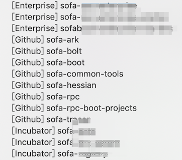
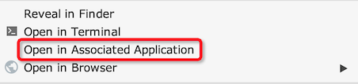
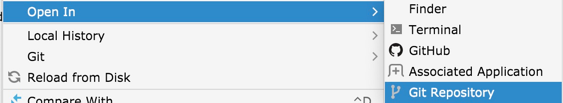

# my-idea-toolkit

自用的 IntelliJ IDEA 插件，包含如下功能：

|功能| 说明 | 版本|
|---|---|---|
| 历史记录排序 | 后台对最近打开的历史工程自动排序 | v1.0 |
| 用关联程序打开 | 对文件使用系统的关联程序打开 | v1.1 |
| 打开Git远程仓库 | 在浏览器中打开git工程对应的仓库 | v1.2 |

## 历史记录记录排序

首先在工程的 「File - Project Structure - Project」 里设置 Project Name。
后台会定时进行排序，效果参见：

## 系统命令打开

效果参见：

改动：
- v1.2 调整位置，更贴近原生

# 打开Git仓库

效果参见：

