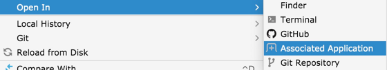

# my-idea-tookkit

自用的 IntelliJ IDEA 插件，包含如下功能：

|功能| 说明 | 版本|
|---|---|---|
| 历史记录排序 | 对最近打开的历史文件进行排序 | v1.0 |
| 用系统命令打开 | 对文件使用系统的方式打开 | v1.1 |

## 历史记录记录排序

首先在工程的 File-Project Structure - Project 里设置 Project Name。
效果参见：

## 系统命令打开

效果参见：

